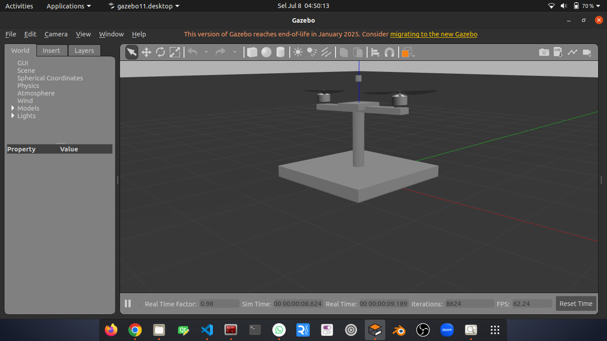

# 🤖 task_1

Pada proyek ini, akan diimplementasikan kontrol PID menggunakan platform Gazebo. Fokus simulasi adalah pada sistem jungkat-jungkit yang memiliki dua motor di sisi kiri dan kanan serta sensor gyroscope di bagian tengah.

Tugas utama adalah membuat program kontrol PID yang mampu menjaga keseimbangan jungkat-jungkit agar tetap stabil. Input dari sistem berupa data sudut dari gyroscope, sedangkan output berupa kecepatan dua motor di sisi kiri dan kanan.

## 📦 Instalasi Gazebo ROS Noetic

```bash
sudo apt update
sudo apt install \
  ros-noetic-joint-state-publisher-gui \
  ros-noetic-robot-state-publisher \
  ros-noetic-gazebo-ros-pkgs \
  ros-noetic-gazebo-ros-control \
  ros-noetic-xacro \
  ros-noetic-rviz \
  ros-noetic-controller-manager \
  ros-noetic-effort-controllers \
  ros-noetic-joint-state-controller \
  ros-noetic-transmission-interface \
  ros-noetic-control-toolbox \
  ros-noetic-ros-controllers \
  ros-noetic-tf \
  ros-noetic-tf2-ros
```

## 📦 Instalasi Gazebo ROS Melodic

```bash
sudo apt update
sudo apt install \
  ros-melodic-joint-state-publisher-gui \
  ros-melodic-robot-state-publisher \
  ros-melodic-gazebo-ros-pkgs \
  ros-melodic-gazebo-ros-control \
  ros-melodic-xacro \
  ros-melodic-rviz \
  ros-melodic-controller-manager \
  ros-melodic-effort-controllers \
  ros-melodic-joint-state-controller \
  ros-melodic-transmission-interface \
  ros-melodic-control-toolbox \
  ros-melodic-ros-controllers \
  ros-melodic-tf \
  ros-melodic-tf2-ros\
```

---

## 📥 Clone Repository

### Clone repo ini ke `src`:

```bash
cd ~/catkin_ws/src
git clone https://github.com/setyawan-dev/task_1.git
```

---

## 🛠️ Build Workspace

```bash
cd ~/catkin_ws
catkin build
source devel/setup.bash
```

---

## 🚀 Menjalankan Simulasi

### 1. Menjalankan Gazebo:

```bash
roslaunch task_1 open_project.launch
```


### 2. Menjalankan Contoh Program:
```bash
rosrun task_1 vel_control_node
```
Masukan input untuk kecepatan atau stop program
```bash
Masukkan kecepatan (kiri kanan) atau 'stop' untuk keluar: 30 80
Masukkan kecepatan (kiri kanan) atau 'stop' untuk keluar: 50 50
Masukkan kecepatan (kiri kanan) atau 'stop' untuk keluar: stop

```

### 3. Lihat Data yang siap digunakan:
```bash
rostopic list
```
maka akan muncul:
```bash
/clock
/gazebo/link_states
/gazebo/model_states
/gazebo/parameter_descriptions
/gazebo/parameter_updates
/gazebo/performance_metrics
/gazebo/set_link_state
/gazebo/set_model_state
/gyro/data
/imu/data
/motor_kanan_controller/command
/motor_kanan_controller/pid/parameter_descriptions
/motor_kanan_controller/pid/parameter_updates
/motor_kanan_controller/state
/motor_kanan_joint/command
/motor_kiri_controller/command
/motor_kiri_controller/pid/parameter_descriptions
/motor_kiri_controller/pid/parameter_updates
/motor_kiri_controller/state
/motor_kiri_joint/command
/pivot_joint_controller/command
/rosout
/rosout_agg
/vel/cmd
```
---
### 4. DATA PENTING:
1. Kontrol motor kiri dan kanan
```bash
/vel/cmd
```
```bash
Motor Kiri = linear.x
Motor Kanan = angular.x
```

2. Data gyroscope
```bash
/gyro/data
```
```bash
orientation.x (Vektor sumbu rotasi (arah))
orientation.y (Vektor sumbu rotasi (arah))
orientation.z (Vektor sumbu rotasi (arah))
orientation.w (Besarnya rotasi dalam bentuk sudut (cos(θ/2)))
```


---
### CLUE
```bash
1.Inisialisasi Node ROS
  Program memulai node baru untuk menjalankan proses kendali PID berbasis data gyro.

2.Deklarasi Publisher dan Subscriber
  Mempersiapkan publisher untuk mengirimkan perintah ke topik kecepatan.
  Mempersiapkan subscriber untuk menerima data dari sensor gyro.

3.Inisialisasi Parameter PID
  Menyusun nilai parameter pengendali (proposional, integral, derivatif) dan variabel penyimpanan data sebelumnya.

4.Masuk ke Fungsi Loop
  Program masuk ke perulangan utama yang berjalan terus selama ROS aktif.

5.Perhitungan Error dan PID
  Menghitung selisih antara nilai target dan nilai saat ini.
  Mengolah error menjadi nilai output berdasarkan rumus PID.
    # Rumus PID di bawah ini:

      self.current_pitch = data gyro

      error = 0.0 - self.current_pitch

      self.integral += error * dt

      derivative = (error - self.prev_error) / dt

      output = self.kp * error + self.ki * self.integral + self.kd * derivative

      self.prev_error = error

6.Konversi Output ke Kecepatan Motor
  Mengubah nilai output menjadi dua nilai kecepatan motor (kanan dan kiri), dengan pembatas nilai maksimum dan minimum. (set min max speed)

7.Mempersiapkan dan Mengirimkan Perintah
  Membuat pesan kecepatan yang siap dikirim, lalu menerbitkannya ke topik.
  (publish ke topik /cmd/vel)

8.Menampilkan Data ke Terminal
  Menampilkan nilai pitch dari gyro, error, dan kecepatan hasil PID ke terminal.

```